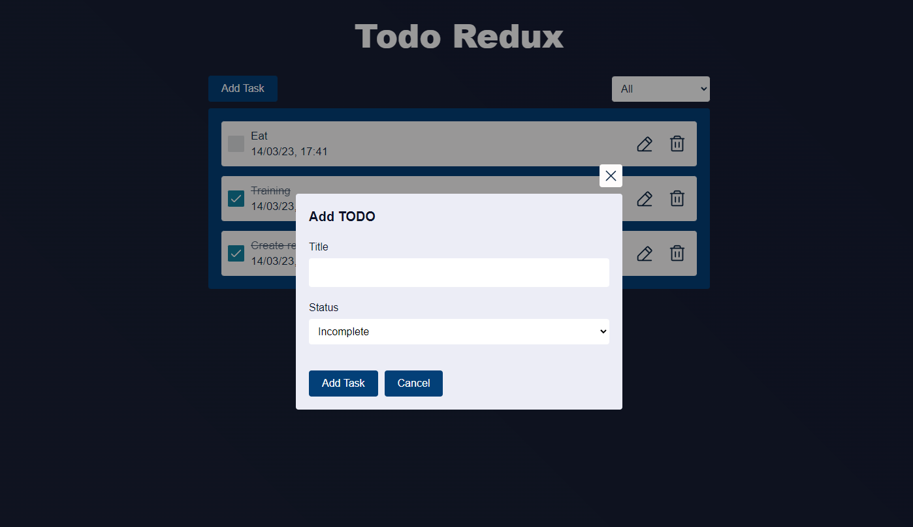

# Todo Redux

O projeto de criação de tarefas em Redux é uma aplicação web, que utiliza a biblioteca Redux para gerenciar o estado global da aplicação. O usuário pode criar, editar e excluir tarefas sem um banco de dados, já que o  objetivo é para fins didáticos, demonstrar como utilizar o Redux para gerenciar o fluxo de dados em uma aplicação web. A interface do usuário é simples e intuitiva, com uma lista de tarefas na página inicial. O projeto é uma solução escalável e eficiente para gerenciar o estado global de uma aplicação web com Redux.

## Tech Stack

- [JavaScript](https://developer.mozilla.org/pt-BR/docs/Web/JavaScript)
- [React](https://reactjs.org)
- [Redux](https://redux.js.org/)
- [Phosphor](https://phosphoricons.com)
- [Framer Motion](https://www.framer.com/motion)
- [SASS](https://www.npmjs.com/package/node-sass)

## Instruções

  

    <strong>Clique para ver o passo a passo 🚀</strong>

 

1. Clone o repositório
- Use o comando: `git clone git@github.com:LeonardoMonti/todo-redux.git`
- Entre na pasta do repositório que você acabou de clonar:
  - `cd todo-redux`
2. Instale as dependências
  - execute `npm install` 
3. Inicie o servidor, rodando `npm start`
4. Para utilizar o aplicativo web, basta acessar o [http://localhost:3000](http://localhost:3000) em algum browser

## Meu [Linkedin](https://www.linkedin.com/in/leonardomonti/)